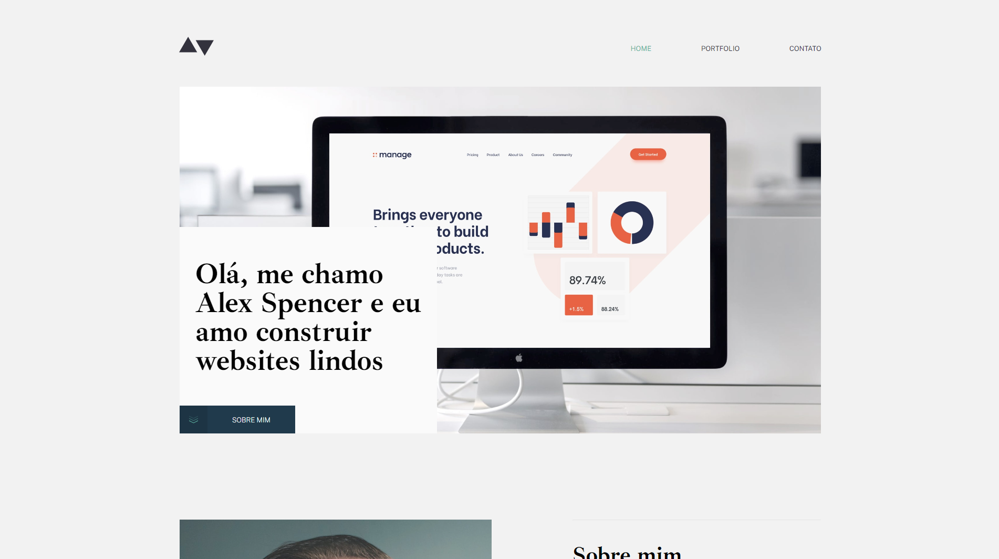

<h1 align="center"> Modelo de site para portfólio </h1>

Página web criada como modelo de site para portfólio.

  <a href="#-tecnologias">Tecnologias</a>&nbsp;&nbsp;&nbsp;|&nbsp;&nbsp;&nbsp;
  <a href="#-projeto">Projeto</a>&nbsp;&nbsp;&nbsp;|&nbsp;&nbsp;&nbsp;
  <a href="#-layout">Layout</a>&nbsp;&nbsp;&nbsp;

 

  

## 🚀 Tecnologias

Esse projeto foi desenvolvido com as seguintes tecnologias:

- HTML e CSS
- JavaScript
- Git e Github

## 💻 Projeto

Esse é um projeto simples que visa o estudo de HTML, CSS e JavaScript.

## 🔖 Layout

Você pode visualizar o layout do projeto através [DESSE LINK](https://www.figma.com/file/amCmF4CGydSdmkg6XT85S1/Desafio-front-academy-1?t=qvvaEcG6zydxbByz-1). É necessário ter conta no [Figma](https://figma.com) para acessá-lo.
